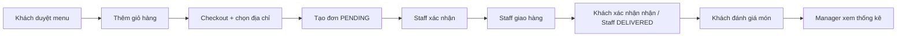
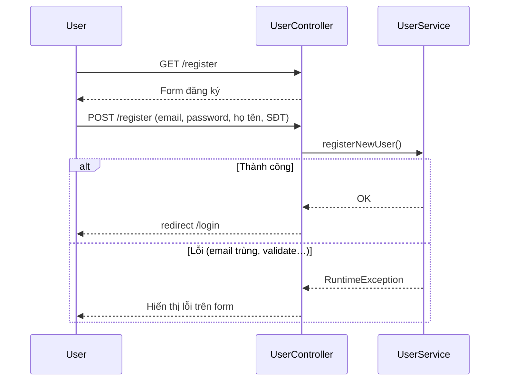
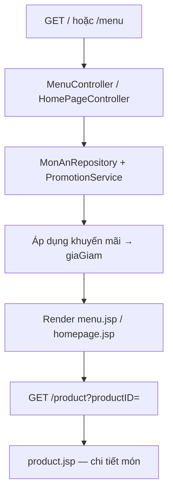
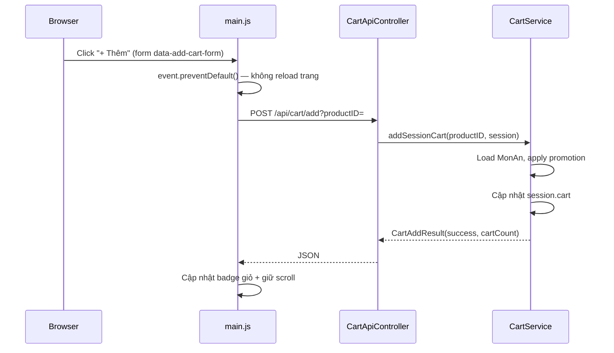
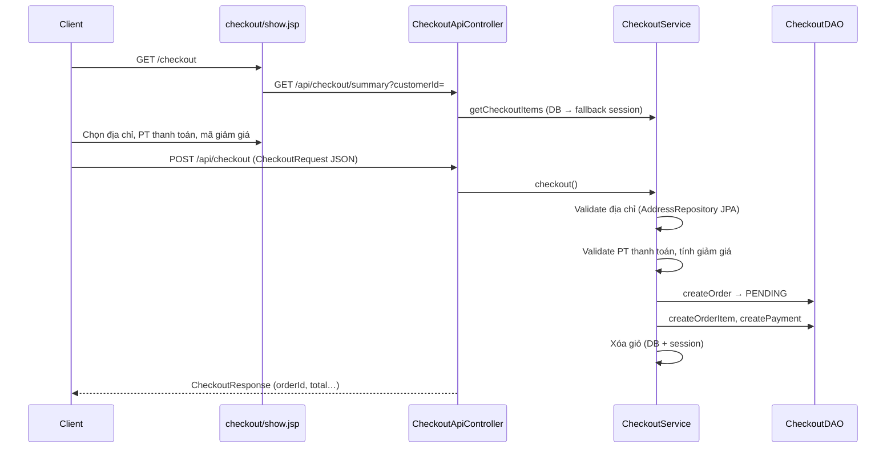
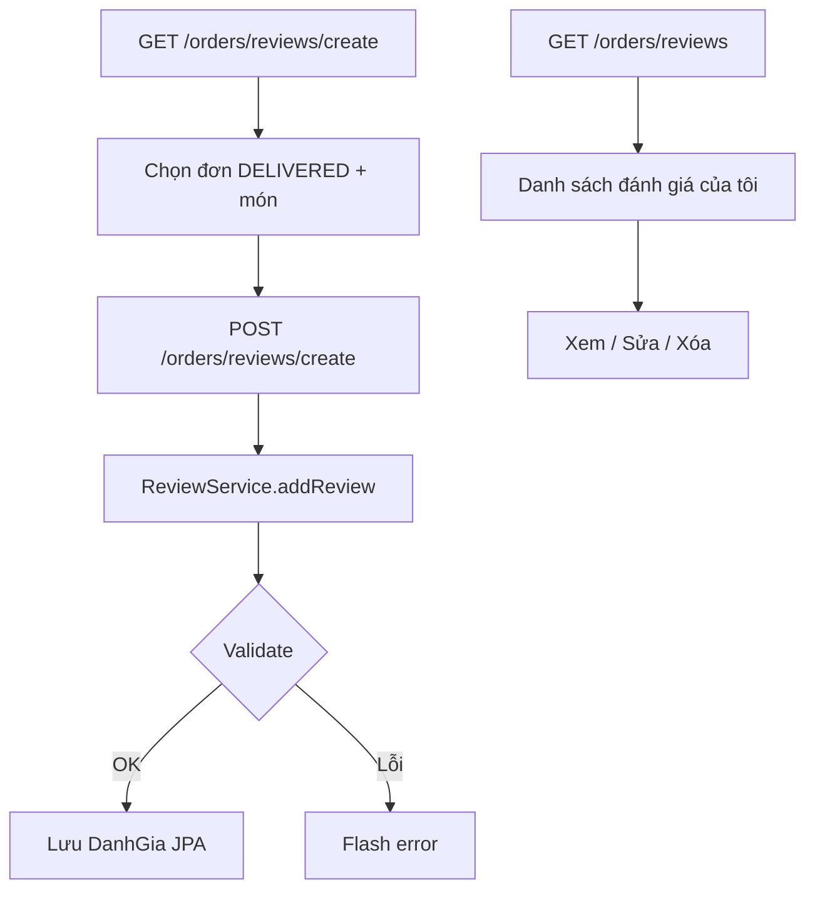
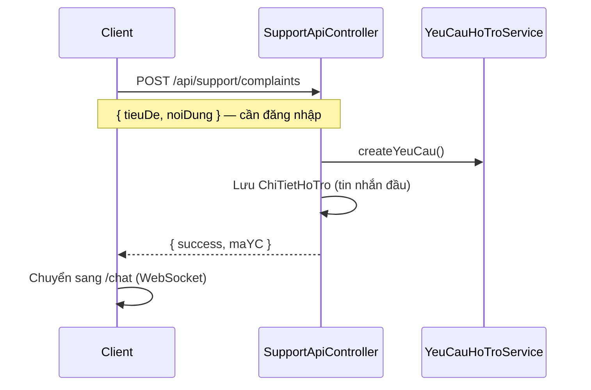
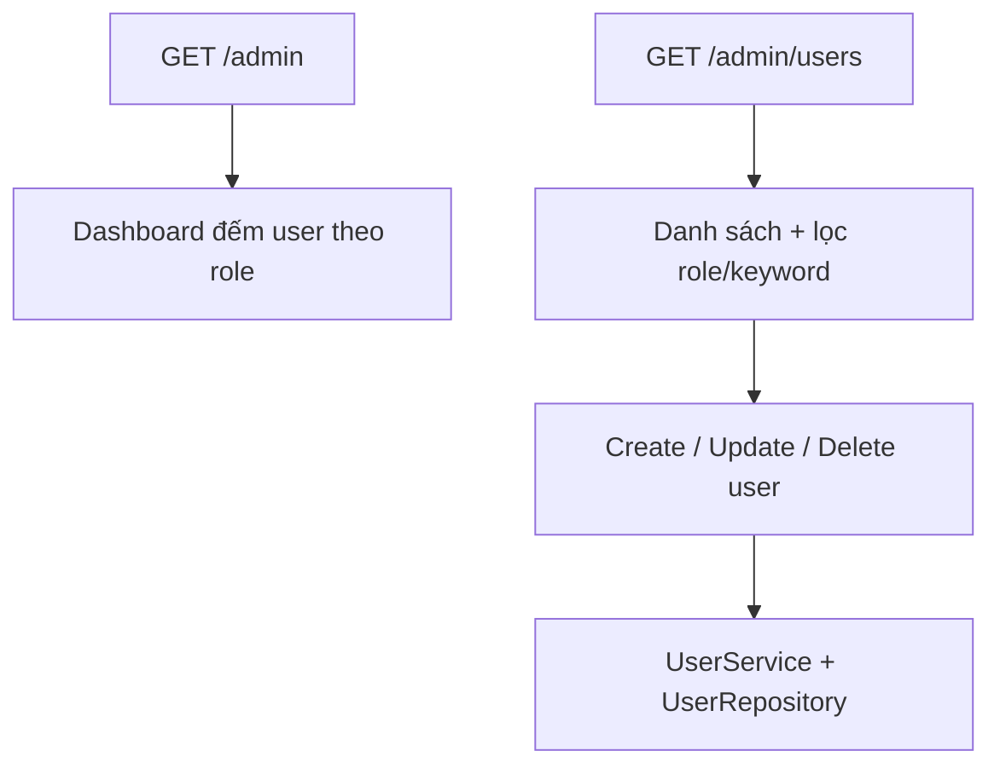
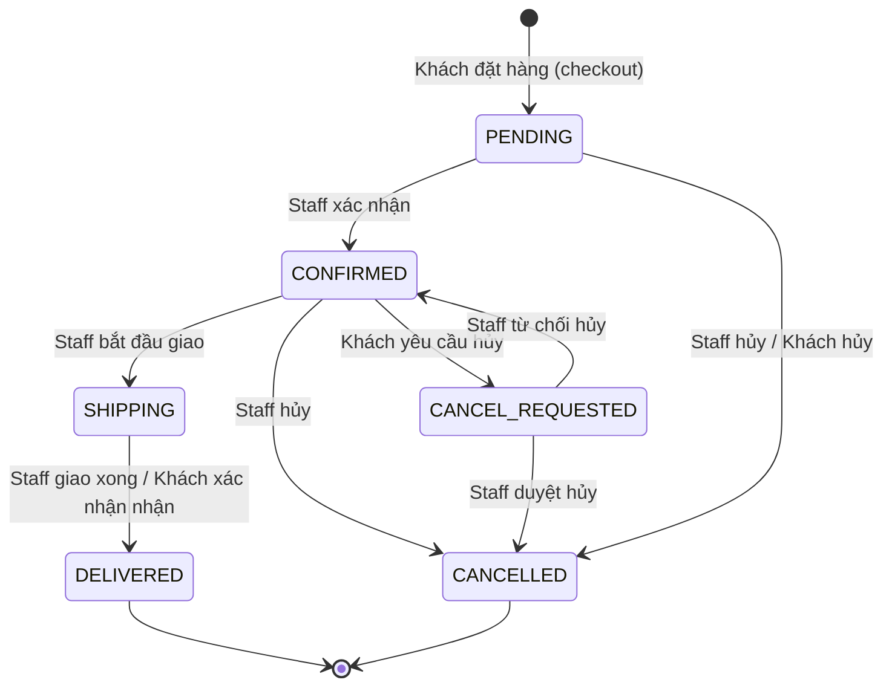
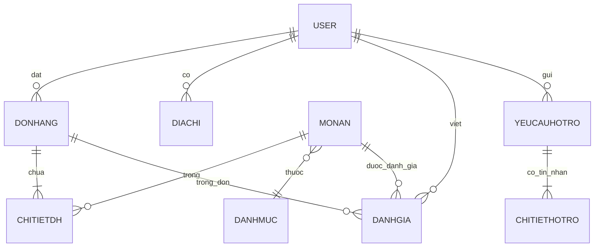

# Phân tích luồng nghiệp vụ — Jollibug

> Tài liệu mô tả toàn bộ luồng chức năng của hệ thống đặt món fast-food **Jollibug**.  
> Stack: Java 17 · Spring Boot · JSP · Oracle DB · Session + JDBC + JPA.

---

## Mục lục

1. [Tổng quan hệ thống](#1-tổng-quan-hệ-thống)
2. [Vai trò & phân quyền](#2-vai-trò--phân-quyền)
3. [Kiến trúc kỹ thuật](#3-kiến-trúc-kỹ-thuật)
4. [Luồng xác thực (Auth)](#4-luồng-xác-thực-auth)
5. [Luồng Client — Khách hàng](#5-luồng-client--khách-hàng)
6. [Luồng Staff — Nhân viên](#6-luồng-staff--nhân-viên)
7. [Luồng Manager — Quản lý](#7-luồng-manager--quản-lý)
8. [Luồng Admin — Quản trị hệ thống](#8-luồng-admin--quản-trị-hệ-thống)
9. [Máy trạng thái đơn hàng](#9-máy-trạng-thái-đơn-hàng)
10. [Bảng tổng hợp API](#10-bảng-tổng-hợp-api)
11. [Dữ liệu mẫu & tài khoản test](#11-dữ-liệu-mẫu--tài-khoản-test)
12. [Điểm cần lưu ý / hạn chế hiện tại](#12-điểm-cần-lưu-ý--hạn-chế-hiện-tại)

---

## 1. Tổng quan hệ thống

Jollibug là web app đặt món ăn nhanh gồm 4 portal:

| Portal | URL gốc | Mô tả |
|--------|---------|--------|
| **Client** | `/`, `/menu`, `/cart`… | Khách duyệt menu, giỏ hàng, checkout, đơn hàng, đánh giá |
| **Staff** | `/staff/orders` | Nhân viên xử lý đơn, chat hỗ trợ |
| **Manager** | `/manager` | Quản lý danh mục, món, KM, mã giảm giá, thống kê |
| **Admin** | `/admin` | Quản lý tài khoản người dùng hệ thống |

### Luồng nghiệp vụ cốt lõi (happy path)



---

## 2. Vai trò & phân quyền

| Vai trò | MaVT (data.sql) | Email mẫu | Redirect sau login |
|---------|-----------------|-----------|-------------------|
| CLIENT | 1 | `user1@fastfood.vn`, `user6@fastfood.vn` | `/` |
| STAFF | 2 | `user2@fastfood.vn`, `user20@fastfood.vn` | `/staff/orders` |
| MANAGER | 3 | `user3@fastfood.vn` | `/manager` |
| ADMIN | 4 | `user4@fastfood.vn` | `/admin` |

**Mật khẩu mẫu:** `123456`

Session lưu:
- `user` — entity `User`
- `userId` — `MaTK`
- `userRole` — tên vai trò (`CLIENT`, `STAFF`, `MANAGER`, `ADMIN`)

---

## 3. Kiến trúc kỹ thuật

### 3.1. Lớp xử lý

```
Browser (JSP + JS)
    ↓
Controller (Spring MVC / REST)
    ↓
Service (business logic)
    ↓
Repository (JPA)  hoặc  DAO (JDBC)
    ↓
Oracle Database
```

### 3.2. Hai hệ dữ liệu song song (quan trọng)

| Thành phần | Công nghệ | Bảng / Entity | Dùng cho |
|------------|-----------|---------------|----------|
| **JPA (mới)** | Hibernate | `DonHang`, `DanhGia`, `MonAn`, `DiaChi`… | Manager thống kê, đánh giá, địa chỉ, quản lý món/danh mục |
| **JDBC (cũ)** | `OrderDAO`, `CheckoutDAO`, `CartDAO` | Schema cột cũ (`MaTK_KH`, `TrangThaiDon`, `TongTienMon`…) | Client lịch sử đơn, Staff xử lý đơn, Checkout tạo đơn |

> **Hệ quả:** Thống kê Manager (JPA) và trang Staff/Client đơn hàng (JDBC) có thể **không đồng bộ** nếu schema chưa thống nhất. Đánh giá dùng JPA `DonHang`; chi tiết đơn client dùng JDBC `OrderDAO`.

### 3.3. Giỏ hàng — hai nguồn

| Nguồn | Cách lưu | Khi nào dùng |
|-------|----------|--------------|
| **Session cart** | `session.setAttribute("cart", List<CartItem>)` | Thêm món từ menu/homepage (`POST /api/cart/add`) — luồng chính |
| **DB cart** | Bảng `GIOHANG` + `CHITIETGH` | Fallback nếu có giỏ DB; checkout ưu tiên DB trước session |

`CartService`, `CheckoutService` đều có **fallback session** khi DB trống.

### 3.4. Khởi tạo DB

- `spring.jpa.hibernate.ddl-auto=create` — mỗi lần restart tạo lại schema
- `data.sql` — nạp dữ liệu mẫu (user, món, đơn, đánh giá, địa chỉ…)
- Oracle: `localhost:1522/ORCLPDB`, user `fastfooddb`

---

## 4. Luồng xác thực (Auth)

### 4.1. Đăng ký



**File liên quan:** `UserController.java`, `client/register.jsp`

### 4.2. Đăng nhập

```mermaid
sequenceDiagram
    participant U as User
    participant C as UserController
    participant S as UserService

    U->>C: POST /login (email, password)
    C->>S: login()
    S-->>C: User + VaiTro
    C->>C: session.user, session.userId, session.userRole
    alt ADMIN → /admin
    alt MANAGER → /manager
    alt STAFF → /staff/orders
    alt CLIENT → /
    end
```

### 4.3. Quên mật khẩu / xác minh email

| Bước | URL | Mô tả |
|------|-----|--------|
| 1 | `GET /forgot-password` | Nhập email |
| 2 | `POST /forgot-password` | Gửi OTP qua email (Resend SMTP) |
| 3 | `GET /verify` | Nhập mã OTP |
| 4 | `GET /new-password` | Đặt mật khẩu mới |

**Service:** `EmailVerificationService`

### 4.4. Đăng xuất

- `GET /logout` → `session.invalidate()`
- CLIENT → `/` · các role khác → `/login`

### 4.5. Hồ sơ cá nhân

| Chức năng | URL |
|-----------|-----|
| Xem/sửa profile | `GET/POST /profile`, `/profile/update` |
| Đổi mật khẩu | `GET/POST /reset-password` |

---

## 5. Luồng Client — Khách hàng

### 5.1. Duyệt menu & sản phẩm



**Bộ lọc menu (`GET /menu`):**
- `categoryID` — lọc danh mục
- `keyword` — tìm kiếm
- `filter` — `popular` | `price-low` | `price-high` | `rating`

**Khuyến mãi:** `PromotionService.applyPromotions()` gắn `giaGiam`, `phanTramGiam` trước khi hiển thị.

---

### 5.2. Thêm giỏ hàng



**Trang hỗ trợ AJAX thêm giỏ:**
- `menu.jsp`, `homepage.jsp`, `product.jsp`
- JS: `resources/js/client/main.js`

**Luồng cũ (đã thay thế):** `POST /addCart` → redirect — gây reload trang.

---

### 5.3. Quản lý giỏ hàng

| Hành động | UI | API |
|-----------|-----|-----|
| Xem giỏ | `GET /cart` → `cart.jsp` | `GET /api/cart?customerId=` |
| Tăng/giảm SL | Nút +/- | `PUT /api/cart/items` |
| Xóa món | Modal xác nhận | `DELETE /api/cart/items` |

**JS:** `resources/js/client/cart-api.js`  
**Logic:** `CartService` — ưu tiên DB cart, fallback session cart khi cập nhật.

---

### 5.4. Checkout (Đặt hàng)



**CheckoutRequest gồm:**
- `customerId`, `maDC` (mã địa chỉ đã lưu)
- `maPT` — `COD` | `CREDIT_CARD` | `BANK` | `EWALLET`
- `discountCode` (tuỳ chọn)
- `ghiChu`

**Validation địa chỉ:** `maDC` phải thuộc user đang đăng nhập (`AddressRepository`).

**Mã giảm giá:** `GET /api/voucher/validate?code=&subtotal=`

---

### 5.5. Quản lý địa chỉ

| Chức năng | URL |
|-----------|-----|
| Danh sách | `GET /address` |
| Thêm | `GET/POST /address/create` |
| Sửa | `GET/POST /address/update/{id}` |
| Xóa | `GET/POST /address/delete/{id}` |
| Đổi địa chỉ checkout | `GET /checkout/changeAddress` |

**Entity:** `DiaChi` (JPA) · **Service:** `AddressService`

---

### 5.6. Lịch sử & chi tiết đơn hàng

```mermaid
flowchart TD
    A[GET /orders] --> B[order-history.jsp + order-history.js]
    B --> C[GET /api/orders?customerId=]
    C --> D[OrderDAO — JDBC]
    A2[Tab lọc trạng thái] --> B
    E[GET /orders/detail?orderId=] --> F[order-detail.js]
    F --> G[GET /api/orders/{id}?customerId=]
```

**Tab lọc (ProfileController):**
- `/orders` — tất cả
- `/orders/pending`, `/confirmed`, `/shipping`, `/delivered`, `/cancelled`

**Hành động trên chi tiết đơn (`order-detail.js`):**

| Trạng thái | Hành động khách | API |
|------------|-----------------|-----|
| PENDING, CONFIRMED | Hủy đơn | `POST /api/orders/{id}/cancel` |
| SHIPPING | Xác nhận đã nhận | `POST /api/orders/{id}/received` |
| DELIVERED | Nút đánh giá từng món (modal) | *Chưa implement `submitReview()`* |

**Luồng hủy đơn (client):**
- `PENDING` → chuyển thẳng `CANCELLED`
- `CONFIRMED` → chuyển `CANCEL_REQUESTED` (chờ staff xử lý)

---

### 5.7. Đánh giá món ăn



**Quy tắc nghiệp vụ (`ReviewService`):**

| Rule | Mô tả |
|------|--------|
| R1 | Chỉ đánh giá đơn `DELIVERED` |
| R2 | Đơn phải thuộc khách đang đăng nhập |
| R3 | Món phải có trong `CHITIETDH` của đơn |
| R4 | Mỗi (đơn + món + khách) chỉ 1 đánh giá |
| R5 | Sao 1–5, nội dung không rỗng |

**API REST (`ReviewApiController`):**

| Method | URL |
|--------|-----|
| GET | `/api/reviews` |
| GET | `/api/reviews/{id}` |
| POST | `/api/reviews?orderId=` |
| PUT | `/api/reviews/{id}` |
| DELETE | `/api/reviews/{id}` |

**API từ chi tiết đơn:** `POST /api/orders/{orderId}/reviews` (`ReviewController`)

---

### 5.8. Khiếu nại & hỗ trợ



**Trang:** `client/complaints.jsp`, `client/chat.jsp`  
**WebSocket:** `/app/chat.send` → broadcast `/topic/chat/{maYC}`

---

### 5.9. Chatbot AI

| Endpoint | Mô tả |
|----------|--------|
| `POST /api/ai/chat` | Gửi câu hỏi → Groq LLM (llama-3.1-8b-instant) |

**UI:** Widget chat góc màn hình (`jollibug-ai-chat.js`) trên menu/homepage.

---

### 5.10. Mã giảm giá (phía client)

- `ClientCouponController` — trang client xem coupon
- Validate lúc checkout: `/api/voucher/validate`

---

## 6. Luồng Staff — Nhân viên

### 6.1. Quản lý đơn hàng (vận hành)

```mermaid
flowchart TD
    A[GET /staff/orders] --> B[staff-orders.js]
    B --> C[GET /api/staff/orders?status&keyword&fromDate&toDate]
    C --> D[OrderDAO.getOrdersForStaff]
    E[Click dòng đơn] --> F[GET /staff/order-detail?orderId=]
    F --> G[staff-order-detail.js]
    G --> H[GET /api/staff/orders/{id}]
    I[Cập nhật trạng thái] --> J[PUT /api/staff/orders/{id}/status]
    J --> K[OrderService.updateOrderStatusByStaff]
    K --> L[Ghi OrderStatusHistory]
```

**Bộ lọc:** trạng thái, từ ngày–đến ngày, từ khóa (mã đơn, mã khách, ghi chú)

**Staff cập nhật trạng thái — luồng hợp lệ:** xem [Mục 9](#9-máy-trạng-thái-đơn-hàng)

---

### 6.2. Hỗ trợ khách hàng

| Chức năng | URL |
|-----------|-----|
| Danh sách yêu cầu | `GET /staff/support` |
| Chat realtime | WebSocket `ChatController` |
| Trả lời đánh giá | `POST /staff/support/review/reply` |

**Trạng thái yêu cầu hỗ trợ:** `Pending` → `Processing` (khi staff gửi tin đầu)

---

### 6.3. Quản lý khách hàng (Staff)

| URL | Mô tả |
|-----|--------|
| `GET /staff/clients` | Danh sách khách |
| `GET /staff/clients/detail` | Chi tiết khách |

---

## 7. Luồng Manager — Quản lý

Manager **không xử lý đơn trực tiếp** — chỉ quản lý catalog + xem báo cáo.

### 7.1. Dashboard

- `GET /manager` — tổng quan doanh thu, đơn hàng, khách hàng (tháng)
- `GET /manager/dashboard/stats` — API JSON cho biểu đồ

### 7.2. Quản lý danh mục

```mermaid
flowchart LR
    A[/manager/categories] --> B[List]
    B --> C[Create / Update / Delete / Detail]
    C --> D[CategoryService]
    D --> E[DanhMuc JPA]
    C --> F[/api/manager/categories REST]
```

### 7.3. Quản lý món ăn

| Luồng | URL JSP | API |
|-------|---------|-----|
| Danh sách + tìm kiếm | `/manager/products` | `GET /api/manager/products` |
| Tạo món | `/manager/products/create` | `POST /api/manager/products` |
| Chi tiết | `/manager/products/detail` | `GET /api/manager/products/{id}` |
| Sửa | `/manager/products/update` | `PUT /api/manager/products/{id}` |
| Xóa | `/manager/products/delete` | `DELETE /api/manager/products/{id}` |

**JS:** `resources/js/manager/products.js`  
**Khuyến mãi tự động áp dụng khi client xem menu** (không sửa giá gốc trong DB).

### 7.4. Quản lý khuyến mãi

- CRUD: `/manager/promotions/*`
- Entity: `ChuongTrinhGiamGia` — gắn % giảm theo món/danh mục

### 7.5. Quản lý mã giảm giá

- CRUD: `/manager/coupons/*`
- Entity: `MaGiamGia` — mã code, thời hạn, loại giảm

### 7.6. Thống kê

| Trang | URL | Dữ liệu |
|-------|-----|---------|
| Doanh thu | `/manager/statistics/revenue?period=` | `DonHangRepository.sumRevenue` (DELIVERED) |
| Đơn hàng | `/manager/statistics/orders?period=` | Tổng đơn, phân bố trạng thái, biểu đồ |
| Khách hàng | `/manager/statistics/customers?period=` | Top KH, số KH có đơn |

**Period:** `today` | `week` | `month` | `year`

**Service:** `ThongKeService` — so sánh % tăng/giảm so với kỳ trước.

### 7.7. Flash sale (placeholder)

- Routes: `/manager/flash-sales/*` — JSP mock, chưa có logic backend đầy đủ

---

## 8. Luồng Admin — Quản trị hệ thống



**Chức năng:**
- Xem thống kê số user theo vai trò & trạng thái
- CRUD tài khoản (gán vai trò ADMIN/MANAGER/STAFF/CLIENT)
- Ban / kích hoạt tài khoản

---

## 9. Máy trạng thái đơn hàng

### 9.1. Sơ đồ trạng thái



### 9.2. Ai được chuyển trạng thái?

| Chuyển đổi | Staff | Client |
|------------|-------|--------|
| → CONFIRMED | ✅ | ❌ |
| → SHIPPING | ✅ | ❌ |
| → DELIVERED | ✅ | ✅ (khi SHIPPING, nút "Đã nhận hàng") |
| → CANCELLED | ✅ | ✅ (PENDING trực tiếp) |
| → CANCEL_REQUESTED | ❌ | ✅ (từ CONFIRMED) |
| CANCEL_REQUESTED → CONFIRMED/CANCELLED | ✅ | ❌ |

**Lịch sử:** Mỗi lần đổi trạng thái ghi vào `OrderStatusHistory` (actor: CUSTOMER / STAFF).

---

## 10. Bảng tổng hợp API

### Client

| Nhóm | Base path | Mô tả |
|------|-----------|--------|
| Giỏ hàng | `/api/cart` | GET, POST /add, PUT /items, DELETE /items |
| Checkout | `/api/checkout` | GET /summary, POST |
| Đơn hàng | `/api/orders` | CRUD trạng thái, chi tiết, hủy, nhận hàng |
| Đánh giá | `/api/reviews` | CRUD đánh giá |
| Đánh giá (đơn) | `/api/orders/{id}/reviews` | POST tạo đánh giá |
| Voucher | `/api/voucher/validate` | Kiểm tra mã giảm giá |
| Thanh toán | `/api/payments/order/{id}` | Thông tin thanh toán đơn |
| Hỗ trợ | `/api/support/complaints` | Gửi khiếu nại |
| AI | `/api/ai/chat` | Chatbot |

### Staff

| Base path | Mô tả |
|-----------|--------|
| `/api/staff/orders` | Danh sách, chi tiết, cập nhật trạng thái |

### Manager

| Base path | Mô tả |
|-----------|--------|
| `/api/manager/categories` | CRUD danh mục |
| `/api/manager/products` | CRUD món ăn |

---

## 11. Dữ liệu mẫu & tài khoản test

### Chạy ứng dụng

```powershell
cd "c:\IS\JAVA\ĐỒ ÁN\Jollibug"
$env:JAVA_HOME="C:\Program Files\Java\jdk-17"
.\mvnw.cmd spring-boot:run
```

URL: http://localhost:8080

### Dữ liệu có sẵn trong `data.sql`

| Loại | Số lượng / Ghi chú |
|------|---------------------|
| Users | 20 user (CLIENT, STAFF, MANAGER, ADMIN) |
| Món ăn | ~24 món, nhiều danh mục |
| Đơn hàng | ~25 đơn (PENDING, CONFIRMED, DELIVERED, CANCELLED) |
| Chi tiết đơn | Đơn #1, #2, #3, #5 có `CHITIETDH` |
| Đánh giá mẫu | User1 → đơn #1 món #1; User6 → đơn #2 món #6 |
| Địa chỉ | User1 (2 địa chỉ), User6 (1 địa chỉ) |

### Kịch bản test nhanh theo luồng

| # | Luồng | Các bước |
|---|-------|----------|
| 1 | Mua hàng | Login user1 → menu → thêm giỏ → cart +/- → checkout |
| 2 | Xử lý đơn | Login user2 → staff/orders → PENDING → DELIVERED |
| 3 | Đánh giá | Login user1 → /orders/reviews/create → chọn đơn #3 |
| 4 | Thống kê | Login user3 → /manager/statistics/orders |
| 5 | Quản lý món | Login user3 → /manager/products → CRUD |
| 6 | Khiếu nại | Login user1 → /complaints → /chat |

---

## 12. Điểm cần lưu ý / hạn chế hiện tại

### 12.1. Schema đơn hàng song song

- **JPA `DonHang`:** `MaTK`, `TrangThai`, `TongTien`, `DiaChiGiaoHang`
- **JDBC `OrderDAO`:** `MaTK_KH`, `TrangThaiDon`, `TongTienMon`, `ThanhTien`, `MaDC`

Checkout tạo đơn qua JDBC; thống kê Manager đọc JPA. Cần thống nhất schema để end-to-end mượt.

### 12.2. Modal đánh giá trên chi tiết đơn

- `order-detail.jsp` gọi `submitReview()` nhưng **hàm chưa có** trong `order-detail.js`
- Nên dùng `/orders/reviews/create` cho đến khi implement

### 12.3. Trang delivered.jsp / confirmed.jsp

- Một số tab đơn hàng vẫn là **mockup tĩnh** (dữ liệu hardcode)
- Luồng thật: `/orders` + `order-history.js` load từ API

### 12.4. Restart = mất dữ liệu tự thêm

- `ddl-auto=create` xóa DB mỗi lần chạy lại
- Chỉ giữ lại data trong `data.sql`

### 12.5. Giá kem / món đơn vị

- Entity `MonAn.donVi` (cây, phần…) hiển thị trên menu/product
- Checkout phải đọc đúng giá từ session cart (đã áp KM)

### 12.6. Bảo mật

- Phần lớn API nhận `customerId` từ query/body — nên validate khớp `session.userId`
- Spring Security cấu hình cơ bản; session-based auth

---

## Phụ lục — Sơ đồ entity chính



---

*Tài liệu được sinh từ phân tích codebase Jollibug. Cập nhật khi có thay đổi controller/service.*
