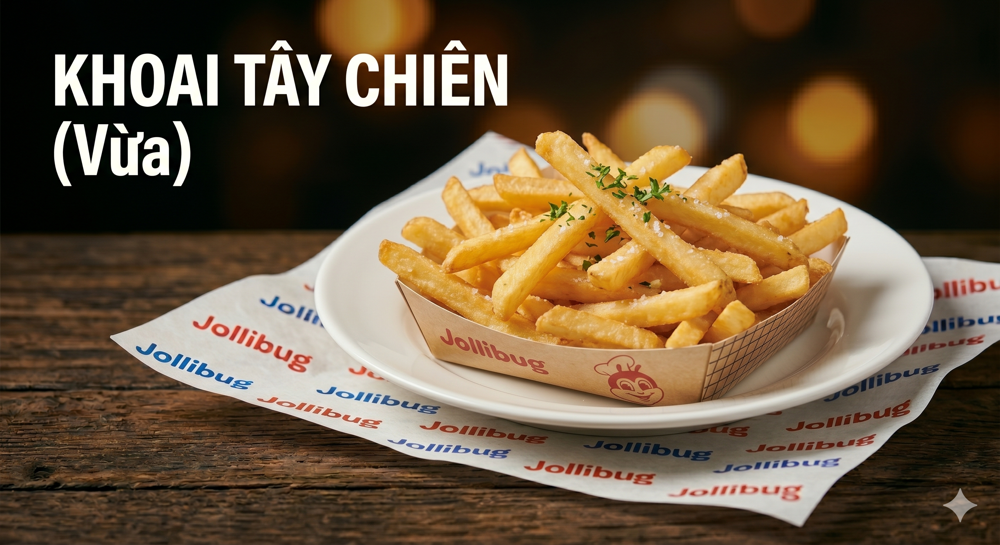

<p align="center">
  
</p>

<h1 align="center">Jollibug</h1>

<p align="center">
  Hệ thống đặt đồ ăn nhanh trực tuyến xây dựng bằng Spring Boot, JSP/Servlet và Oracle Database.
</p>

## Tổng quan

Jollibug là dự án web đặt đồ ăn nhanh trực tuyến hỗ trợ nhiều vai trò như khách hàng, nhân viên, quản lý và admin. Hệ thống bao gồm các luồng xem menu, đặt món, thanh toán, theo dõi đơn hàng, quản lý sản phẩm, voucher, khuyến mãi và hỗ trợ khách hàng.

- Kiến trúc web app sử dụng Spring Boot, Spring MVC, JSP/Servlet và JPA/Hibernate.
- Dữ liệu chính được lưu trên Oracle Database.
- Giỏ hàng hiện tại được quản lý theo session trong ứng dụng.
- Hỗ trợ chat realtime qua WebSocket.
- Có luồng gửi email cho xác thực tài khoản và quên mật khẩu.
- Có chatbot thông qua Spring AI.

## Thành viên nhóm

| STT | Họ và tên | MSSV | 
|---|---|---|---|---|
| 1 | Nguyễn Mạnh Trí | 24521834 | 
| 2 | Huỳnh Nguyễn Hoàng Thịnh | 2452xxxx | 
| 3 | Nguyễn Bá Thiên | 2452xxxx | 
| 4 | Nguyễn Khánh Vi | 2452xxxx | 


## Chức năng chính

### Khách hàng

- Đăng ký, đăng nhập, đăng xuất.
- Xác thực email và khôi phục mật khẩu.
- Xem trang chủ, menu và chi tiết món ăn.
- Thêm món vào giỏ hàng và cập nhật số lượng.
- Quản lý địa chỉ giao hàng.
- Áp dụng mã giảm giá.
- Thanh toán và tạo đơn hàng.
- Xem lịch sử đơn hàng, chi tiết đơn hàng và trạng thái xử lý.
- Hủy đơn, xác nhận đã nhận hàng, đặt lại đơn cũ.
- Đánh giá sản phẩm sau khi đơn đã giao.
- Chat hỗ trợ với cửa hàng.

### Nhân viên

- Xem danh sách đơn hàng.
- Xác nhận đơn và cập nhật trạng thái.
- Theo dõi và xử lý yêu cầu hỗ trợ.
- Trả lời đánh giá và chat với khách hàng.

### Quản lý

- Xem dashboard tổng quan.
- Quản lý sản phẩm và danh mục.
- Quản lý mã giảm giá và chương trình khuyến mãi.
- Theo dõi thống kê doanh thu và đơn hàng.

### Admin

- Quản lý tài khoản người dùng.
- Tạo, cập nhật, khóa/mở khóa tài khoản.

## Công nghệ sử dụng

### Backend

- Java 17
- Spring Boot 4
- Spring MVC
- Spring Data JPA
- Hibernate
- Spring Validation
- Spring Security
- Spring Session JDBC
- Spring WebSocket
- Spring Mail
- Spring AI

### Frontend

- JSP
- JSTL
- HTML, CSS, JavaScript
- Chart.js

### Database

- Oracle Database
- H2 có trong dependency để phục vụ một số trường hợp runtime/dev

### Build tool

- Maven

## Cấu trúc thư mục

```text
Jollibug/
|-- src/
|   |-- main/
|   |   |-- java/vn/fastfood/
|   |   |   |-- config/
|   |   |   |-- controller/
|   |   |   |   |-- admin/
|   |   |   |   |-- client/
|   |   |   |   |-- manager/
|   |   |   |   `-- staff/
|   |   |   |-- dao/
|   |   |   |-- dto/
|   |   |   |-- entity/
|   |   |   |-- model/
|   |   |   |-- repository/
|   |   |   |-- service/
|   |   |   `-- util/
|   |   |-- resources/
|   |   |   |-- application.properties
|   |   |   |-- schema.sql
|   |   |   |-- data.sql
|   |   |   `-- Function-Trigger.sql
|   |   `-- webapp/
|   |       |-- WEB-INF/view/
|   |       `-- resources/
|   `-- test/
|-- docs/
|-- pom.xml
|-- mvnw
|-- mvnw.cmd
`-- sampledb.sql
```

## Yêu cầu môi trường

- JDK 17
- Maven 3.9+ hoặc Maven Wrapper
- Oracle Database
- IDE khuyến nghị: IntelliJ IDEA, Eclipse, VS Code

## Hướng dẫn chạy dự án

### 1. Clone source

```bash
git clone <repository-url>
cd Jollibug
```

### 2. Cấu hình database

Dự án hiện đang đọc cấu hình Oracle trong [application.properties](/d:/Storage/Documents/Jollibug/src/main/resources/application.properties).

Giá trị hiện tại:

```properties
spring.datasource.url=jdbc:oracle:thin:@localhost:1521/mynewprojectdb
spring.datasource.username=timo
spring.datasource.password=...
```

Bạn cần:

- Tạo schema Oracle phù hợp.
- Hoặc sửa lại `spring.datasource.url`, `spring.datasource.username`, `spring.datasource.password` theo máy của bạn.

### 3. Khởi tạo schema và dữ liệu

Ứng dụng đang được cấu hình để chạy SQL init lúc startup:

```properties
spring.jpa.hibernate.ddl-auto=none
spring.sql.init.mode=always
spring.sql.init.schema-locations=classpath:schema.sql
spring.sql.init.data-locations=classpath:data.sql
```

Nếu bạn muốn khởi tạo từ đầu:

- Đảm bảo schema Oracle đang sạch hoặc phù hợp với `schema.sql`
- Kiểm tra `data.sql` nếu muốn nạp dữ liệu mẫu

### Chạy trigger trong Oracle

Sau khi đã tạo bảng và dữ liệu, hãy chạy thêm file trigger riêng trong SQL Developer:

- [Function-Trigger.sql](/d:/Storage/Documents/Jollibug/src/main/resources/Function-Trigger.sql)

File này hiện chứa các trigger chính như:

- Cập nhật tồn kho khi thêm chi tiết đơn hàng
- Hoàn lại tồn kho khi hủy đơn
- Tự động cập nhật `updated_at` cho một số bảng

### Chạy ứng dụng

Trên Windows:

```bash
mvnw.cmd spring-boot:run
```

Hoặc nếu đã cài Maven:

```bash
mvn spring-boot:run
```

## Lưu ý về dữ liệu và schema

- Dự án dùng `schema.sql` và `data.sql` để khởi tạo database.
- `ddl-auto` hiện đang để `none`, vì vậy Hibernate không tự tạo schema.
- Nếu bật `ddl-auto=validate`, schema thực tế trong Oracle phải khớp hoàn toàn với entity JPA.
- Giỏ hàng đang được lưu trong session, không còn dùng bảng chi tiết giỏ hàng trong JPA nữa.

## Hình minh họa

### Logo dự án


### Giao diện trang chủ


### Một số hình ảnh sản phẩm




## File quan trọng

- [pom.xml](/d:/Storage/Documents/Jollibug/pom.xml): cấu hình dependency và build
- [application.properties](/d:/Storage/Documents/Jollibug/src/main/resources/application.properties): cấu hình app, DB, mail, AI
- [schema.sql](/d:/Storage/Documents/Jollibug/src/main/resources/schema.sql): tạo bảng
- [data.sql](/d:/Storage/Documents/Jollibug/src/main/resources/data.sql): dữ liệu mẫu
- [Function-Trigger.sql](/d:/Storage/Documents/Jollibug/src/main/resources/Function-Trigger.sql): trigger Oracle chạy riêng sau khi tạo bảng
- [sampledb.sql](/d:/Storage/Documents/Jollibug/sampledb.sql): script tham khảo bổ sung


